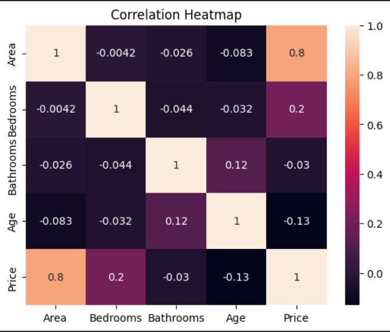

# Multi-Domain Data Analysis Project

## Overview

This project demonstrates exploratory data analysis across multiple domains using Python. 
The goal is to extract meaningful insights from different types of datasets through visualization and statistical analysis.

## Domains Covered

1. Retail Sales Analysis
2. Real Estate Market Analysis
3. Financial Market Analysis
4. Weather Data Analysis
5. Education Data Analysis

## Tools and Technologies

- Python
- Pandas
- NumPy
- Matplotlib
- Seaborn
- Jupyter Notebook

## Project Structure

- Notebooks/ → contains analysis notebooks
- datasets/ → raw datasets used in analysis

  ## Projects

### Retail Sales Analysis

Notebook: [Retail Sales Analysis Notebook](Retail_Analysis/retail_sales_analysis.ipynb)

Description: Analysis of supermarket retail sales to identify revenue trends, product performance, and customer behavior patterns using Python and Pandas.

### Real Estate Market Analysis

Notebook: [Real Estate Analysis Notebook](RealEstate_Analysis/real_estate_analysis.ipynb)

Description: Analysis of real estate data to understand housing price trends, location impact on prices, and property market patterns.

### Financial Market Analysis

Notebook: [Financial Market Analysis Notebook](Finance_Analysis/financial_market_analysis.ipynb)

Description: Analysis of financial market datasets to explore stock behavior, price fluctuations, and overall market trends.

### Weather Data Analysis

Notebook: [Weather Data Analysis Notebook](Weather_Analysis/weather_data_analysis.ipynb)

Description: Analysis of weather datasets to study temperature trends, rainfall patterns, and seasonal variations.

### Education Data Analysis

Notebook: [Education Data Analysis Notebook](Education_Analysis/education_data_analysis.ipynb)

Description: Analysis of student performance and education data to identify factors affecting academic results.

  
## Key Analysis Techniques

- Data cleaning
- Exploratory data analysis
- Correlation analysis
- Data visualization
- Trend identification

## Insights

The analysis across different domains highlights patterns in sales performance, housing price distributions, financial trends, climate patterns, and education statistics.

## Notebooks

### Retail Sales Analysis
Explores sales trends, product performance, and revenue patterns.

### Real Estate Analysis
Analyzes housing prices and property characteristics.

### Financial Market Analysis
Studies stock price movements and financial indicators.

### Weather Data Analysis
Examines temperature and precipitation patterns.

### Education Data Analysis
Analyzes student performance and education metrics.

## Analysis Workflow

Each project follows a structured data analysis workflow:

### Data Overview  
Understanding dataset structure and variables.

### Data Cleaning  
Handling missing values, correcting data types, and preparing the dataset for analysis.

### Exploratory Data Analysis  
Using statistical summaries and visualizations to understand the dataset.

### Visualization  
Charts such as bar plots, line charts, heatmaps, and distributions to reveal patterns.

### Insights  
Key observations and conclusions drawn from the data.

## Datasets

Datasets used in these projects are stored within their respective project folders. These datasets are used for educational and analytical purposes.

## Requirements

All required Python libraries are listed in the requirements.txt file.

## To install them:

pip install -r requirements.txt

Purpose of this Portfolio

## This portfolio demonstrates the ability to:

Work with real datasets  
Clean and preprocess data  
Perform exploratory data analysis  
Create meaningful visualizations  
Extract insights and communicate findings

## Author

Sadaf  
Data Analytics Project
